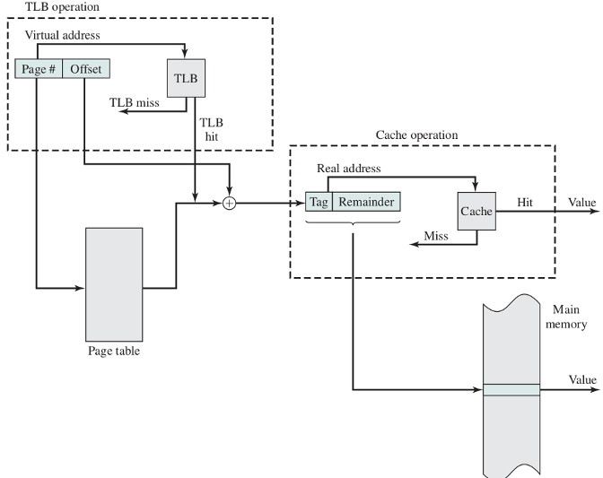
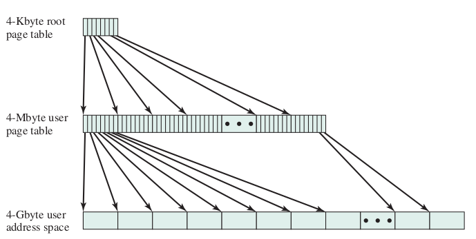
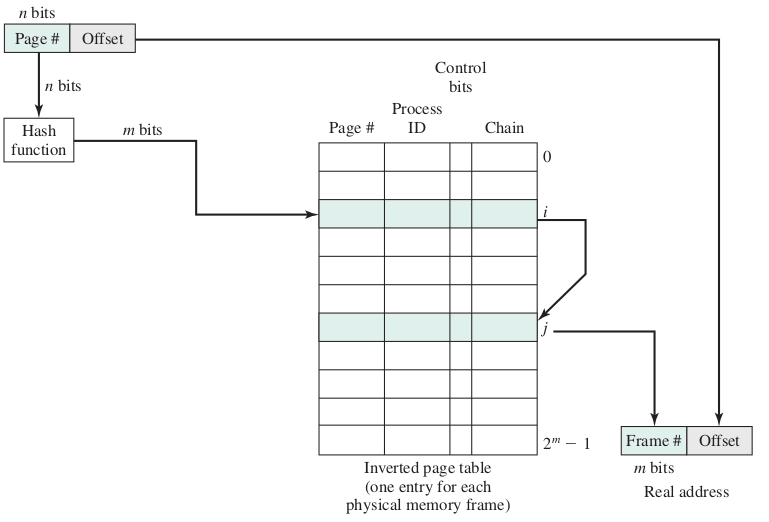
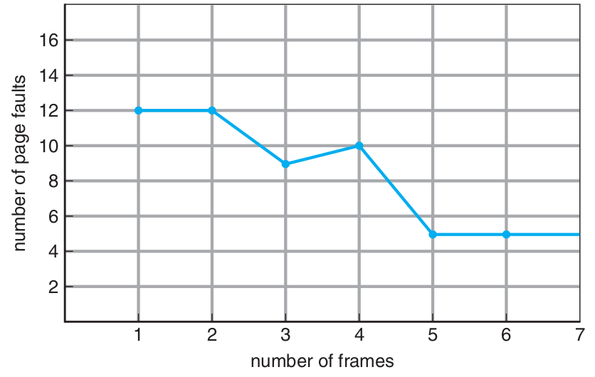

.. meta::
   :http-equiv=Content-Language: fa

:data-transition-duration: 1000
:skip-help: true
:css: style.css
:substep: true

.. title: Operating Systems - Memory  (By Ahmad Yoosofan)

:slide-numbers: true

.. role:: ltr
    :class: ltr

Operating Systems 
==============================
Memory Management
---------------------------
Ahmad Yoosofan

University of Kashan

Fall 2020

----

بخش‌های درونی یک فرآیند در حالت کلی

.. image:: img/memory/memory_precess_addressing_parts.png
   :align: center

----

مشخص شدن آدرس‌های حافظهٔ فرآیند

.. image:: img/memory/memory_program_address_binding.png
   :align: center

----

.. image:: img/memory/memory_linking_loading_scenario.png
   :align: center
   :scale: 90%

----

address binding, loader

.. image:: img/memory/memory_address_binding_loader.png
   :align: center
   :scale: 90%

----

address binding, linker

.. image:: img/memory/memory_address_binding_linker.png
   :align: center
   :scale: 90%

----

address binding, absolute and relocate loader

.. image:: img/memory/memory_absolute_relocate_loader.png
   :align: center
   :scale: 90%

----

چگونگی کارکرد پیوند زدن تابع‌ها از پرونده‌های گوناگون

.. image:: img/memory/memory_linking_function.png
   :align: center

----

تخصیص حافظهٔ پیوسته به فرآیندها
===================================================
به فرآیندها حافظهٔ پیوسته‌ای داده شود.

----

بخش‌بندی ثابت حافظه

.. image:: img/memory/memory_fixed_partitioning.png
   :align: center

----

تخصیص حافظه به فرآیندها در حالت بخش‌بندی ثابت حافظه

.. image:: img/memory/memory_fixed_allocation.png
   :align: center

----

مشکلات بخش‌بندی ثابت
=======================================================================================

.. raw:: html

    

.. class:: substep

    #. انعطاف بسیار پایین
    #. محدودیت زیاد برای اندازهٔ فرایند در حالی که فضای حافظه خالی است.
    #. تکه تکه شدن یا پراکندی داخلی internal fragmentation
    #. هدر رفت حافظه
        * بخشی از حافظه که به فرایند داده شده است فقط برای آن فرایند است. 
        * یعنی اگر بخشی از آن را فرایند به کار نبرد هدر رفته است.

.. raw:: html

    

----

تکه تکه شدن (پراکندگی) داخلی حافظه
==============================================================================================
Internal Memory Fragmentation

https://www.geeksforgeeks.org/difference-between-internal-and-external-fragmentation/

.. :

  operating system internal memory fragmentation fixed size partitioning

----

به کارگیری حافظهٔ نسبی برای نگهداری مکان چندین فرآیند در حافظه

.. image:: img/memory/base_limit_register.png
   :align: center

----

حفاظت از حافظه به کمک ثبات‌های پایه و حد

.. image:: img/memory/hardware_address_protection.png
   :align: center

----

بخش‌بندی پویای حافظه

.. image:: img/memory/memory_management_pc.png
   :align: center

----

ارتباط میان آدرس فیزیکی و آدرس منطقی در آدرس دهی نسبی به کمکِ واحد مدیریت حافظه (MMU)

----

حافظهٔ فرآیندها در سیستم عامل CTSS

.. image:: img/memory/memory_of_CTSS.png
   :align: center

----

اثر به کارگیری حافظهٔ پویا

.. image:: img/memory/memory_effect_of_dynamic_partitioning.png
   :align: center

----

برگزیدن فضای آزاد برای فرآیند تازه وارد
===================================================

.. class:: substep

    *  اولین برازش(First Fit)
    *  بهترین برازش(Best Fit)
    *  بدترین برازش(Worst Fit)
    *  درپی برازش (برازش بعدی Next Fit)

----

----

تکه تکه شدن (پراکندگی یا پارگی) خارجی
======================================================================================================
External Fragmentation

----

Compaction
============

.. ::

    https://web.fe.up.pt/~arestivo/presentation/os-memory/#15

    Memory-Compaction-in-contiguous-memory-allocation-1.jpg
    https://binaryterms.com/contiguous-memory-allocation-in-operating-system.html

    compaction.png
    https://github.com/mor1/ia-operating-systems/wiki/06-Virtual-Addressing
    https://github.com/mor1/ia-operating-systems

    https://www.faceprep.in/operating-systems/operating-systems-fragmentation-and-compaction/

    https://slideplayer.com/slide/7084682/

----

حافظهٔ پویای رفاقتی Buddy system

.. image:: img/memory/memory_buddy_system1.png
   :align: center

----

.. image:: img/memory/memory_buddy_system2.png
   :align: center
   :scale: 90%

----

الگوریتم اجرا

.. image:: img/memory/memory_buddy_system3.png
   :align: center

----

جابجا کردن فرآیند میان حافظهٔ‌اصلی و حافظهٔ جانبی (دیسک)، شکل ساده‌ای از حافظهٔ مجازی

----

.. image:: img/memory/suspend_state.png
   :align: center
   :scale: 80%

----

overlay

.. image:: img/memory/memory_ovelay_turbo_c.jpg
   :align: center
   :width: 500px
   :height: 700px

----

سلسله مراتب حافظه

.. image:: img/memory/memory_hierarchy_1_4_StorageDeviceHierarchy.jpg
   :align: center

`cs.uic.edu <https://www.cs.uic.edu/~jbell/CourseNotes/OperatingSystems/images/Chapter1/1_4_StorageDeviceHierarchy.jpg>`_

----

سلسله مراتب حافظه جزئی‌تر

.. image:: img/memory/memory_hierarchy_hei.png
   :align: center

`bit-tech.net <href="http://images.bit-tech.net/content_images/2007/11/the_secrets_of_pc_memory_part_1/hei.png>`_

----

حافظهٔ نهان

.. image:: img/memory/memory_cache_Cache_hierarchy-example.svg
   :align: center

`wikipedia.org Cache,hierarchy <https://en.wikipedia.org/wiki/File:Cache,hierarchy-example.svg>`_
`wikipedia.org CPU_cache <https://en.wikipedia.org/wiki/CPU_cache>`_

----

حافظهٔ نهان دو سطحی در یک پردازندهٔ واقعی

.. image:: img/memory/memory_cache_image025.jpg
   :align: center

`link <https://www.byclb.com/TR/Tutorials/dsp_advanced/ch1_1_dosyalar/image025.jpg>`_

----

الگوریتم خواندن و نوشتن از حافظهٔ نهان

.. image:: img/memory/memory_cache_read_write_algorithm_Write-back_with_write-allocation.svg
   :align: center

`link1 <https://upload.wikimedia.org/wikipedia/commons/c/c2/Write-back_with_write-allocation.svg>`_
`link2 <https://en.wikipedia.org/wiki/Cache_(computing)>`_

----

Effective Access Time (EAT)
================================
.. class:: substep

    * t\ :sub:`m` : زمان دسترسی به حافظه‌ی اصلی
    * t\ :sub:`c` : زمان دسترستی به حافظه‌ی نهان
    * h\ :sub:`c` : ضریب اصابت به حافظه‌ی نهان

    .. math::
      
      EAT = h_c * t_c + ( 1 - h_c ) * ( t_m + t_c ) 

----

اگر ضریب اصابت (یا نسبت اصابت) برای 0.95 باشد و سرعت دسترسی به حافظهٔ اصلی 100 میکرو ثانیه باشد و سرعت دسترسی حافظهٔ نهان ۱ میکرو ثانیه باشد در این صورت زمان دسترسی مؤثر برابر خواهد بود با

.. class:: substep

    * EAT = 0.95 * 1 + (1 − 0.95) * (100 + 1)
    * EAT = 0.95 + 0.05 * 101
    * EAT = 0.95 + 5.05
    * EAT = 5.1 μs

----

.. image:: img/memory/memory_effect_of_cache.png
   :align: center

----

.. raw:: html

    <table border="1px" ><tr >
    <td>ms</td><td>μs</td><td>ns</td><td>action</td><tr >
    <td></td><td></td><td>0.5</td><td>CPU L1 dCACHE reference</td></tr><tr >
    <td></td><td></td><td>1</td><td>speed-of-light (a photon) travel a 1 ft (30.5cm) distance</td></tr><tr >
    <td></td><td></td><td>5</td><td>CPU L1 iCACHE Branch mispredict</td></tr><tr >
    <td></td><td></td><td>7</td><td>CPU L2  CACHE reference</td></tr><tr >
    <td></td><td></td><td>71</td><td>CPU cross-QPI/NUMA best  case on XEON E5-46</td><tr >
    <td></td><td></td><td>100</td><td>MUTEX lock/unlock</td><tr >
    <td></td><td></td><td>100</td><td>own DDR MEMORY reference</td><tr >
    <td></td><td>20</td><td>000</td><td>Send 2K bytes over 1 Gbps NETWORK</td><tr >
    <td></td><td>250</td><td>000</td><td>Read 1 MB sequentially from MEMORY</td><tr >
    <td>10</td><td>000</td><td>000</td><td>DISK seek</td><tr >
    <td>10</td><td>000</td><td>000</td><td>Read 1 MB sequentially from NETWORK</td><tr >
    <td>30</td><td>000</td><td>000</td><td>Read 1 MB sequentially from DISK</td><tr >
    <td>150</td><td>000</td><td>000</td><td>Send a NETWORK packet CA -> Netherlands</td><tr >
    </tr></table>
    <a href="https://stackoverflow.com/questions/4087280/approximate-cost-to-access-various-caches-and-main-memory#4087315">[link]</a>

----

حافظهٔ صفحه‌بندی شده
==========================================================
Paging

----

شکل سادهٔ صفحه‌بندی

.. image:: img/memory/paging_model.png
   :align: center

----

.. image:: img/memory/memory_paging_model_address.png
   :align: center

----

----

سخت‌افزار صفحه‌بندی

.. image:: img/memory/paging_hardware.png
   :align: center

----

بخش‌بندی ثبات آدرس در حافظهٔ صفحه‌بندی شده

----

یک کامپیوتر با ۳۲ بایت حافظه و صفحه‌های چهار بایتی

.. class:: substep

    #. Draw Memory Frames
    #. some First Frames for os
    #. Put a process into Memory (not continuous or in order)
    #. Fill page table
    #. Convert a Logical Addfress to Physical Address
    #. Put another process into Memory

----

یک کامپیوتر با حافظهٔ ۳۲ بایت و اندازه‌های قاب  ۸ بایتی و یک فرآیند

d = 3, p = 2

p0 11 bytes

---

یک کامپیوتر با حافظهٔ ۱۲۸ بایتی و صفحه‌های ۸ بایتی

---

.. image:: img/memory/memory_paging_typical_page_table_entry.jpg
   :align: center

----

یک حافظهٔ ۳۲ بایتی با صفحه‌های ۴ بایتی

.. image:: img/memory/paging_example_32_bytes_memory.png
   :align: center

----

تغییرات فضاهای آزاد پیش و پس از تخصیص حافظه به یک فرآیند

.. image:: img/memory/paging_free_frames_before_after.png
   :align: center

----

تغییرات حافظه برای چند فرآیند

----

.. image:: img/memory/memory_paging_process_page_tables.png
   :align: center

----

تبدیل آدرس منطقی به آدرس فیزیکی در حافظهٔ صفحه‌بندی شده

.. image:: img/memory/memory_paging_logical_address_to_physical_address.png
   :align: center

----

.. image:: img/memory/memory_paging_logical_address_to_physical_address_detail.png
   :align: center

----

Address Translation

.. image:: img/memory/memory_paging_address_translation.png
   :align: center

----

اندازهٔ صفحه
===================================================
کوچک یا بزرگ بودن اندازهٔ صفحه‌ها (همان قاب‌های حافظه) بر روی موضوع‌های گوناگونی اثر دارد.

----

حفاظت از حافظهٔ صفحه‌بندی شده

.. image:: img/memory/paging_valid_invalid.png
   :align: center

----

اشتراک گذاری در حافظهٔ صفحه‌بندی شده

.. image:: img/memory/memory_paging_share_pages.png
   :align: center

----

----

سلسه مراتب حافظه

.. image:: img/memory/memory_hierarchy.png
   :align: center

----

Memory Access

.. image:: img/memory/memory_effect_of_cache.png
   :align: center

----

Paging Memory Access

----

TLB

.. image:: img/memory/paging_hardware_with_TLB.png
   :align: center
   :scale: 70%

----

Effective Access Time
-----------------------------------------------------

.. class:: substep

    * t\ :sub:`t` : زمان دسترسی به حافظه‌ی نهان جدول صفحه 
    * t\ :sub:`c` : زمان دسرستی به حافظه‌ی نهان
    * t\ :sub:`m` : زمان دسترسی به حافظه‌ی اصلی
    * h\ :sub:`t` : ضریب اصابت به حافظه‌ی نهان جدول صفحه
    * h\ :sub:`c` : ضریب اصابت به حافظه‌ی نهان

    .. math::
      
      EAT = table +  memory 

      table =  h_t * t_t + ( 1 - h_t ) * ( t_t + t_m )

      memory = h_c * t_c + ( 1 - h_c ) * ( t_m + t_c ) 
        
    با فرض برابر بودن نسبت‌های اصابت و زمان‌های یکسان برای دسترسی به حافظهٔ نهان  و حافظهٔ TLB خواهیم داشت

    .. math::
      :class: ltr
        
      EAT = 2* (h * t_c + ( 1 - h ) * ( t_c + t_m ))

----

زمان دسترسی مؤثر = `زمان دسترسی به جدول صفحه + زمان دسترسی به حافظه`

.. class:: substep

    .. math::

       EAT = 2 * ( h_c * t_c + (1-h_c) * (t_m + t_c) )

       EAT = 2 * ( h_c * t_c + t_m + t_c - h_c * t_m - h_c * t_c )

       EAT = 2 * ( t_c + (1 - h_c) * t_m )
       
    Reduce speed

----

.. class:: substep

    * Max memory supported : 64 byte = 2 ^ 6
    * frame size = page table 2 byte
    * 2 ^ 6 / 2 ^1 = 2 ^ 5 = 32
    * ?

----

.. class:: substep

    * Max memory supported : 64 byte = 2 ^ 6
    * frame size = page table 4 byte
    * 2^6 / 2^2 = 2^4 = 16
    * ?

----

.. class:: substep

    * Max memory supported : 64 byte = 2 ^ 6
    * frame size = page table 8 byte
    * 2^6 / 2^3 = 2^3 = 8 
    * ?

----

.. class:: substep

    * 32 bit address
    * 1024 size of frame?
    * 32 - 10 = 22
    * 2^22 Frame
    * 2^22 page table entry
    * Problem

----

.. class:: substep

    * 32 bit address
    * 2^20 size of frame?
    * 32 - 20 = 12
    * 2^12 Frame

----

صفحه‌بندی دو سطحی
==========================================================================================
.. image:: img/memory/paging_two_level.png
   :align: center

----

آدرس‌دهی در صفحه‌بندی دو سطحی
===================================================
.. image:: img/memory/paging_address_translation_32bit.png
   :align: center

----

.. image:: img/memory/paging_two_level_32bit_address.png
   :align: center

----

.. image:: img/memory/memory_paging_Address_Translation_in_a_Two_Level_Paging_System.png
   :align: center
   :scale: 90%

----

----

صفحه‌بندی دو سطحی ۶۴ بیتی
===================================================
.. image:: img/memory/paging_two_level_64bit.png
   :align: center

----

صفحه‌بندی سه سطحی ۶۴ بیتی
===================================================

----

صفحه‌بندی با جدول صفحهٔ معکوس
==========================================================================================

----

حافظهٔ مجازی
====================================================================================================

----

.. image:: img/memory/virtual_memory_concept.png
   :align: center

----

آدرس‌دهی حافظهٔ مجازی
===================================================
.. image:: img/memory/virtual_memory_addressing.png
   :align: center

----

----

.. image:: img/memory/memory_virtual_valid_invalid.png
   :align: center

----

.. image:: img/memory/memory_virtual_handling_page_fault.png
   :align: center

----

.. image:: img/memory/memory_virtual_Operation_of_Paging_and_Translation_Lookaside_Buffer.png
   :align: center

----

Effective Access Time of Virtual Memory
===========================================
.. class:: substep

    * effective access time = (1 − p) × ma + p × page fault time.
    * effective access time = (1 − p) × (200) + p (8 milliseconds) = (1 − p) × 200 + p × 8,000,000 = 200 + 7,999,800 × p
    * 220 > 200 + 7,999,800 × p,
    * 20 > 7,999,800 × p,
    * p < 0.0000025

----

تخصیص قاب‌ها Allocation of frames
===================================================
.. class:: substep

    *  درخواستی On demand
    *  پیش صفحه‌بندی prepaging

----

روش‌های تخصیص تعداد قاب به هر فرآیند
===================================================
.. class:: substep

    * مجموعهٔ مقیم برای هر فرآیند.

        *  تعداد ثابت fixed-allocation
        *  تعداد متغیر  variable-allocation

    * بخش کردن قاب‌ها میان فرآیندها

        *  تعداد برابر
        *  تعداد به نسبت اندازهٔ فرآیند

    * چگونگی برگزیدن یک قاب برای تخصیص به یک فرآیند

        *  تخصیص محلی
        *  تخصیص سراسری

----

سیاست‌های پاک کردن
===================================================
.. class:: substep

    *  پاک کردن درخواستی demand cleaning
    *  پیش پاک کردن precleaning

----

کپی کردن هنگام نوشتن
===================================================
.. image:: img/memory/memory_virtual_copy_on_write_before.png
   :align: center
   :scale: 70%

----

.. image:: img/memory/memory_virtual_copy_on_write_after.png
   :align: center
   :scale: 70%

----

جایگزینی صفحه
===================================================
.. image:: img/memory/memory_virtual_need4replacement.png
   :align: center
   :scale: 80%

----

.. image:: img/memory/memory_virtual_page_replacement.png
   :align: center
   :scale: 80%

----

* frame-allocation algorithm and a page-replacement algorithm.
* reference string.
* 0100, 0432, 0101, 0612, 0102, 0103, 0104, 0101, 0611, 0102, 0103, 0104, 0101, 0610, 0102, 0103, 0104, 0101, 0609, 0102, 0105
* At 100 bytes per page, this sequence is reduced to the following reference
* string:
* 1, 4, 1, 6, 1, 6, 1, 6, 1, 6, 1
*  تعداد خطای صفحه بسته به تعداد قاب‌های تخصیص داده شده

----

.. image:: img/memory/memory_virtual_page_fault_per_frame_allocated.png
   :align: center
   :scale: 80%

----

الگوریتم جایگزینی FIFO
===================================================
.. image:: img/memory/memory_virtual_page_replacement_FIFO.png
   :align: center
   :scale: 70%

----

Belady’s anomaly
====================

----

الگوریتم جایگزینی بهینه (Optimal)
===================================================

----

الگوریتم جایگزینی NRU
===================================================

----

How to Impolement LRU
===================================================
.. class:: substep

    * counters
    * stacks

----

Use of a stack to record the most recent page references.
===============================================================
.. image:: img/memory/memory_virtual_page_replacement_LRU_stack.png
   :align: center

----

الگوریتم جایگزینی کمترین فراوانی LFU
======================================================================================================
Least Frequently Used

----

الگوریتم جایگزینی بیشترین فراوانی MFU
===================================================

page-replacement algorithm is based on the argument that the page with the smallest count was probably just brought in and has yet to be used

----

Not Recently Used Page Replacement Algorithm
===================================================
NRU

----

الگوریتم جایگزینی بخت دوم (second chance) یا ساعت (clock)
======================================================================================================
بیت دسترسی access bit یا بیت ارجاع reference bit یا بیت استفاده use bit

----

----

الگوریتم جایگزینی ساعت بهبود یافته
===================================================
بیت تغییر modify bit یا بیت کثیف dirty bit

(بیت دسترسی ، بیت تغییر)

.. class:: substep

    * Form 1
        #. Search for (0, 0)
        #. Search for (1, 0) and access bit = 0
        #. goto 1

.. class:: substep

    * Form 2
        #. Search for (0, 0)
        #. Search for (1, 0) and access bit = 0
        #. Search for (0, 0)
        #. Search for (1, 0)

----

الگوریتم میانگیر صفحه
===================================================
PAGE BUFFERING

----

کوبیدگی (Thrashing)
===================================================
.. image:: img/memory/memory_virtual_thrashing.png
   :align: center

----

اصل محلی بودن
===================================================
.. image:: img/memory/memory_virtual_locality_principle.png
   :align: center

----

روش شناسایی کوبیدگی به کمک مدل مجموعهٔ کاری
===================================================
.. image:: img/memory/memory_virtual_thrashing_working_set_model.png
   :align: center
   :scale: 80%

----

.. image:: img/memory/memory_virtual_thrashing_working_set_model_example.png
   :align: center
   :scale: 60%

----

.. image:: img/memory/memory_virtual_thrashing_working_set_model_graph.png
   :align: center
   :scale: 70%

----

روش شناسایی کوبیدگی به کمک فراوانی خطای نبود صفحه
===================================================

page-fault frequency ( PFF )

----

روش‌های رویارویی با کوبیدگی پس از شناسایی آن
===================================================
.. class:: substep

    معلق کردن تعدادی فرآیند برگزیده شده

----

پرونده‌های نگاشت شده به حافظه (Memory-Mapped Files)
===================================================

.. image:: img/memory/memory_virtual_memory_mapped_files.png
   :align: center
   :scale: 60%

----

ورودی و خروجی‌های نگاشت شده به حافظه
======================================================================================================
(I/O-Mapped Files)

----

قفل کردن برخی صفحه‌ها
===================================================
Lock pages

----

اثر نوع برنامه‌نویسی و کامپایلر بر حافظهٔ مجازی
======================================================================================================
.. include:: src/memory_virtual_effect_of_array_programming_row.cpp
  :code: cpp
  :number-lines:
  :class: ltr

----

.. include:: src/memory_virtual_effect_of_array_programming_column.cpp
  :code: cpp
  :number-lines:
  :class: ltr
  
----

قطعه‌بندی (segmentation)
======================================================================================================

----

.. image:: img/memory/memory_segmentation_example.png
   :align: center
   :scale: 80%

----

.. image:: img/memory/memory_segmentation_hardware.png
   :align: center
   :scale: 80%

----

.. image:: img/memory/memory_segmentation_logical2physical_address.png
   :align: center

----

اشتراک گذاری در قطعه‌بندی
===================================================
Sharing segments

----

ترکیب قطعه‌بندی و صفحه‌بندی
======================================================================================================
مانند صفحه‌بندی دو سطحی با این تفاوت که در سطح یکم قطعه‌بندی انجام می‌شود و در سطح دوم صفحه‌بندی انجام می‌شود.

----

----

ساختار حافظهٔ قطعه‌بندی شده در پردازنده‌های اینتل ۳۲ بیتی (IA32)
===================================================================================================
.. image:: img/memory/memory_real_hardware_example_IA-32_segmentation_logical2physical.png
   :align: center
   :scale: 70%

----

.. image:: img/memory/memory_real_hardware_example_IA-32_segmentation.png
   :align: center

----

*  بیشترین حافظه‌ای که می‌تواند پشتیبانی کند: 4GB
*  بیشترین تعداد قطعه در یک فرآیند: 16KB
*  بیشترین تعداد قطعهٔ اختصاصی برای یک فرآیند: 8KB برای دسترسی این بخش local descriptor table ( LDT ) به کار برده می‌شود.
*  بیشترین تعداد قطعهٔ اشتراکی برای یک فرآیند با دیگر فرآیندها: 8KB برای دسترسی به این بخش global descriptor table ( GDT ) به کار برده می‌شود.

----

.. csv-table:: بخش انتخاب کنندهٔ واحد قطعه‌بندی
   :header: `شمارهٔ قطعه`, `اختصاصی یا اشتراکی`, `حفاظت`
   :class: ltr
   
    13, 1, 2

----

ساختار حافظهٔ صفحه‌بندی شده در پردازنده‌های اینتل ۳۲ بیتی (IA32)
===================================================================================================
.. csv-table:: صفحه‌بندی ۴ کیلوبایتی
   :header:    `جدولِ صفحهٔ یکم`, `جدولِ صفحهٔ دوم`, `جابجایی`
   :class: ltr
   
    ۱۰, ۱۰, ۱۲

.. csv-table:: صفحه‌بندی ۴ مگابایتی
   :header:  `جدولِ صفحه`, `جابجایی`
   :class: ltr
   
    ۱۰, ۲۲

----

.. image:: img/memory/memory_real_hardware_example_IA-32_paging_4KB.png
   :align: center

----

.. image:: img/memory/memory_real_hardware_example_IA-32_paging_4KB_page_address_extension.png
   :align: center
   :scale: 70%

----

----

ساختار حافظه در پردازنده‌های «اِ اِم دی» ۶۴ بیتی (AMD64 یا `x86_64` )
===================================================================================================
.. image:: img/memory/memory_real_hardware_example_x86_64_4KB_page_size.png
   :align: center
   :scale: 70%

----

ساختار حافظه در پردازنده‌های «آرم» ۳۲ بیتی (ARM32)
===================================================================================================
.. image:: img/memory/memory_real_hardware_example_ARM32.png
   :align: center
   :scale: 70%

----

References:
==================================================

* `<https://stackoverflow.com/questions/18550370/calculate-the-effective-access-time>`_
* `<http://os-book.com/>`_
* https://en.wikipedia.org/wiki/Paging

.. comments:

    * `<https://en.wikipedia.org/wiki/Page_(computer_memory)>`_
    * http://blog.cs.miami.edu/burt/2012/10/31/virtual-memory-pages-and-page-frames/
    * `<https://www.tldp.org/LDP/tlk/mm/memory.html>`_
    * https://www.geeksforgeeks.org/operating-system-paging/
    * https://samypesse.gitbooks.io/how-to-create-an-operating-system/Chapter-8/
    * https://www.cse.iitb.ac.in/~mythili/teaching/cs347_autumn2016/notes/07-memory.pdf
    * https://www.kernel.org/doc/html/latest/admin-guide/mm/index.html
    * operating systems paging kernel

.. comments:

   hovercraft memory.slide.rst
   rst2html.py memory.slide.rst memory.slide.html
   rst2html.py memory.rst memory.html --stylesheet=../../tools/farsi.css,html4css1.css

