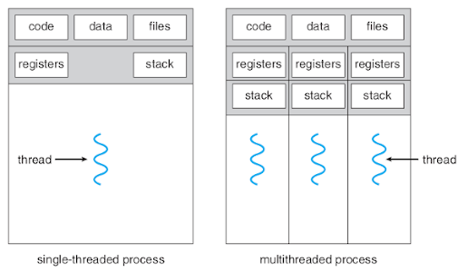

:data-transition-duration: 1000
:skip-help: true
:css: style2.css
:substep: true
:slide-numbers: true
:skip-help: true

.. title: Operating Systems: Thread

----

Operating Systems: Thread
===============================================
Ahmad Yoosofan
-----------------------------
https://yoosofan.github.io

Fall 2020

University of Kashan

----

حالت‌های نخ
========================================================================

.. :

  https://www.tutorialspoint.com/operating_system/os_multi_threading.htm

----

Thread in Python(I)
=====================
.. raw:: html

  

  

.. code:: python
  :number-lines:

  def f1():
    print("This is a test")

  print("main")
  f1()
  print("After f1()")

.. raw:: html

  

.. code:: console
  :class: substep

  main
  This is a test
  After f1()

.. raw:: html

  

.. code:: python
  :number-lines:
  :class: substep

  import threading

  def f1():
    print("This is a test")

  print("main")
  th1 = threading.Thread(target=f1)
  th1.start()
  print("After th1.start()")

.. raw:: html

  

.. code:: sh
  :class: substep

  main
  After th1.start()
  This is a test

.. raw:: html

  

.. code:: sh
  :class: substep

  main
  This is a test
  After th1.start()

.. raw:: html

  

.. code:: sh
  :class: substep

  main
  This is  After th1.start()
  a test

.. raw:: html

  

----

Thread in Python(II)
=====================
.. raw:: html

  

  

.. include:: src/thread/220.py
  :number-lines:
  :code: python

.. raw:: html

  

  

.. code:: console
  :class: substep

  main
  After f1
  After f2
  In f1
  In f2

.. raw:: html

  

  

.. code:: console
  :class: substep

  main
  After f1
  In f1
  After f2
  In f2

.. raw:: html

  

  

.. code:: console
  :class: substep

  main
  After f1
  In f1
  After f2
  In f2

.. raw:: html

  

  

.. code:: console
  :class: substep

  main
  After f1
  After f2
  In f2
  In f1

.. raw:: html

  

  

.. code:: console
  :class: substep

  main
  After In f1
  After f2
  In f2
  f1

.. raw:: html

  

----

Thread in Python(III)
=====================
.. raw:: html

  

  

.. include:: src/thread/240.py
  :number-lines:
  :code: python

.. raw:: html

  

  

.. code:: console
  :class: substep

  python3 240.py > 240output65.txt
  python3 240.py > 240output55.txt
  python3 240.py > 240output45.txt
  python3 240.py > 240output35.txt
  python3 240.py > 240output25.txt

.. raw:: html

  

  

.. code:: console
  :class: substep

  5314 __111
  5315 __111 __main
  1459 __main
  1460 __main

`240output55.txt <src/thread/240output55.txt>`_ : 9108

.. raw:: html

  

  

.. code:: console
  :class: substep

  2139 __main
  2140 __main
  2141
  2336 __222
  2337 __222

`240output55.txt <src/thread/240output55.txt>`_ : 9790

.. raw:: html

  

  

.. code:: console
  :class: substep

  6059 __111
  6060 __111 __main
  2142 __main
  2143 __main

`240output55.txt <src/thread/240output55.txt>`_ : 11281

.. raw:: html

  

  

.. code:: console
  :class: substep

  1589 __111
  1590 __1110 __222
  1 __222
  2 __222

`240output65.txt <src/thread/240output65.txt>`_ : 1590

.. raw:: html

  

----

Thread Python join(I)
========================
.. raw:: html

  

  

.. include:: src/thread/260.py
  :number-lines:
  :code: python

.. raw:: html

  

  

.. include:: src/thread/270.py
  :number-lines:
  :code: python
  :class: substep

.. raw:: html

  

----

Thread Python join(II)
========================
.. raw:: html

  

  

.. include:: src/thread/280.py
  :number-lines:
  :code: python

.. raw:: html

  

  

.. include:: src/thread/290.py
  :number-lines:
  :code: python
  :class: substep

.. raw:: html

  

----

Thread Python parameter
========================
.. raw:: html

  

  

.. include:: src/thread/320.py
  :number-lines:
  :code: python

.. raw:: html

  

  

.. include:: src/thread/330.py
  :number-lines:
  :code: python
  :class: substep

.. raw:: html

  

----

.. raw:: html

  

  

.. include:: src/thread/350.py
  :number-lines:
  :code: python

.. raw:: html

  

  

.. include:: src/thread/360.py
  :number-lines:
  :code: python
  :class: substep

.. raw:: html

  

----

.. image:: img/thread/a3processes.vs.b1process3thread.png
   :align: center

----

.. image:: img/thread/many2one.svg
   :align: center

----

----

----

----

.. image:: img/thread/thread.A.user_level.threads.package.b.A.threads.package.managed.by.the.kernel.png
   :align: center
   :scale: 65%

----

----

.. image:: img/thread/Actual_Parallelism_Vs_Feel_of_Parallelism.jpg
   :align: center

`codeproject: Shivprasad koirala <https://www.codeproject.com/Articles/1267757/Concurrency-vs-Parallelism?msg=5573355#xx5573355xx>`_

----

*  Data parallelism
*  Task parallelism

----

*  user threads
*  kernel threads

----

ارتباط میان حالت‌های نخ‌ها
===========================================
.. image:: img/thread/thread.Examples.of.the.Relationships.between.User_Level.Thread.States.and.Process.States.png
   :align: center
   :scale: 60%

----

سرویس دهندهٔ وب با چند نخ
==========================================
.. image:: img/thread/thread.A.multithreaded.Web.server.png
   :align: center
   :scale: 70%

----

.. image:: img/thread/thread_Multithreaded_server_architecture.png
   :align: center

.. comments:

  rst2html.py thread.rst thread.html --stylesheet=../../tools/farsi.css,html4css1.css

  https://www.c-sharpcorner.com/article/programming-concurrency-in-cpp-part-1/
  https://www.codeproject.com/Articles/1271904/Programming-Concurrency-in-Cplusplus-Part-1
  https://www.codeproject.com/Articles/1267757/Concurrency-vs-Parallelism?msg=5573355#xx5573355xx
  https://medium.com/@sanju.skm/parallel-programming-vs-concurrent-programming-f993d3f9ceea
  https://medium.com/@sanju.skm/parallel-programming-vs-concurrent-programming-f993d3f9ceea
  https://www.eclipse.org/lists/platform-ui-dev/msg07521.html
  
