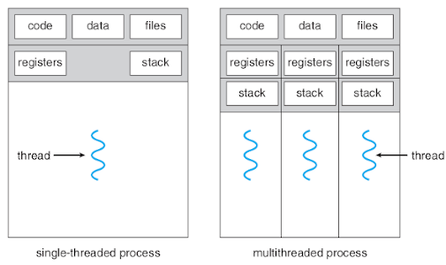
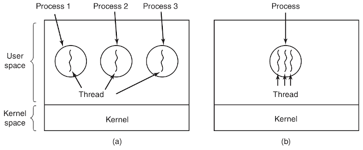
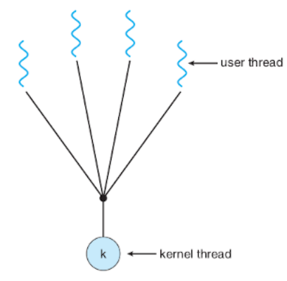
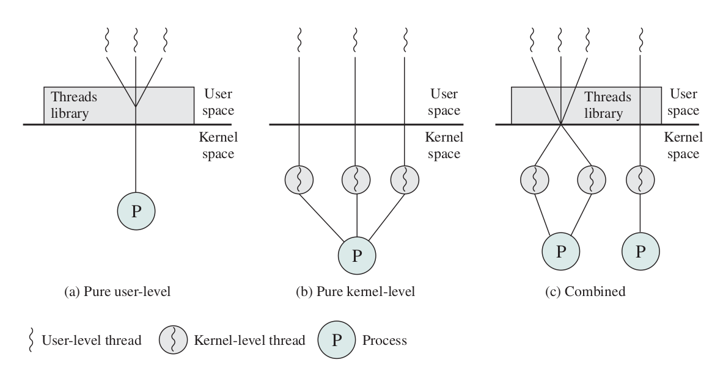
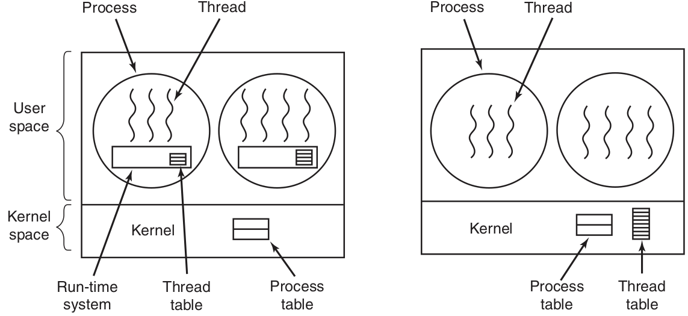
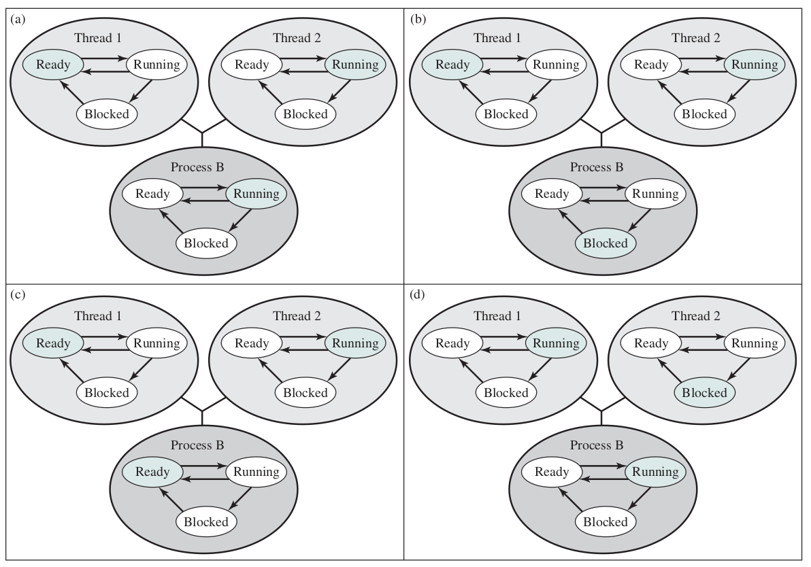
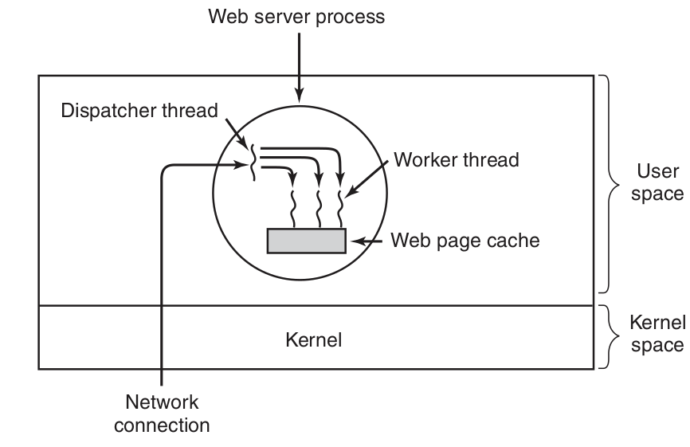
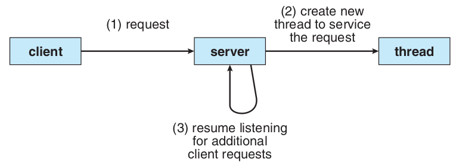

:data-transition-duration: 1000
:skip-help: true
:css: test_thread_style.css
:substep: true
:slide-numbers: true
:skip-help: true

.. title: Operating Systems: Thread

----

Operating Systems: Thread
===============================================
Ahmad Yoosofan
-----------------------------
https://yoosofan.github.io

Fall 2020

University of Kashan

----

حالت‌های نخ
==================

.. :

  https://www.tutorialspoint.com/operating_system/os_multi_threading.htm

----

:id: thread-in-python-i-id

Python Thread (I)
=======================
.. code:: python
  :number-lines:
  :class: substep

  def f1():
    print("This is a test")

  print("main")
  f1()
  print("After f1()")

.. code:: python
  :number-lines:
  :class: substep

  import threading

  def f1():
    print("This is a test")

  print("main")
  th1 = threading.Thread(target=f1)
  th1.start()
  print("After th1.start()")

.. code:: console
  :class: substep

  main
  This is a test
  After f1()

.. code:: console
  :class: substep

  main
  After th1.start()
  This is a test

.. code:: console
  :class: substep

  main
  This is a test
  After th1.start()

.. code:: console
  :class: substep

  main
  This is  After th1.start()
  a test

----

:id: thread-in-python-ii-id

Python Thread (II)
=======================
.. include:: src/thread/220.py
  :number-lines:
  :code: python

.. code:: console
  :class: substep

  main
  After f1
  After f2
  In f1
  In f2

.. code:: console
  :class: substep

  main
  After f1
  In f1
  After f2
  In f2

.. code:: console
  :class: substep

  main
  After f1
  In f1
  After f2
  In f2

.. code:: console
  :class: substep

  main
  After f1
  After f2
  In f2
  In f1

.. code:: console
  :class: substep

  main
  After In f1
  After f2
  In f2
  f1

----

:id: thread-in-python-iii-id

Python Thread (III)
=====================
.. include:: src/thread/240.py
  :number-lines:
  :code: python

.. code:: console
  :class: substep

  python3 240.py > 240output65.txt
  python3 240.py > 240output55.txt
  python3 240.py > 240output45.txt
  python3 240.py > 240output35.txt
  python3 240.py > 240output25.txt

.. code:: console
  :class: substep

  5314 __111
  5315 __111 __main
  1459 __main
  1460 __main

  240output55.txt : 9108

.. code:: console
  :class: substep

  2139 __main
  2140 __main
  2141
  2336 __222
  2337 __222

  240output55.txt : 9790

.. code:: console
  :class: substep

  6059 __111
  6060 __111 __main
  2142 __main
  2143 __main

  240output55.txt : 11281

.. code:: console
  :class: substep

  1589 __111
  1590 __1110 __222
  1 __222
  2 __222

  240output65.txt : 1590

----

:id: thread-in-python-join-i-id

Thread Python join(I)
========================
.. include:: src/thread/260.py
  :number-lines:
  :code: python

.. include:: src/thread/270.py
  :number-lines:
  :code: python
  :class: substep

----

:id: thread-in-python-join-ii-id

Thread Python join(II)
========================
.. include:: src/thread/280.py
  :number-lines:
  :code: python

.. include:: src/thread/290.py
  :number-lines:
  :code: python
  :class: substep

----

:id: thread-in-python-parameter-id

Thread Python parameter
========================
.. include:: src/thread/320.py
  :number-lines:
  :code: python

.. include:: src/thread/330.py
  :number-lines:
  :code: python
  :class: substep

----

:id: thread-in-python-sharing-id

Thread Python Sharing
===========================
.. include:: src/thread/350.py
  :number-lines:
  :code: python

.. include:: src/thread/360.py
  :number-lines:
  :code: python
  :class: substep

----

Threads and Processes
============================

----

Many to One Thread
======================

----

Different Types of Threads
===============================

----

:id: user-kernel-thread-id

User and Kernel Thread
========================
*  user threads
*  kernel threads

.. :

  ----

  .. image:: img/thread/thread_One_to_one_model.png
     :align: center

  ----

  .. image:: img/thread/thread_many_to_many_model.png
     :align: center

----

.. :

  ----

  .. image:: img/thread/thread_two_level_model.png
     :align: center

  ----

  .. image:: img/thread/Actual_Parallelism_Vs_Feel_of_Parallelism.jpg
     :align: center

  `codeproject: Shivprasad koirala <https://www.codeproject.com/Articles/1267757/Concurrency-vs-Parallelism?msg=5573355#xx5573355xx>`_

  ----

  *  Data parallelism
  *  Task parallelism

----

ارتباط میان حالت‌های نخ‌ها
===========================================

----

سرویس دهندهٔ وب با چند نخ
==========================================

----

Threads in Webserver
======================

----

End

.. comments:

  rst2html.py thread.rst thread.html --stylesheet=../../tools/farsi.css,html4css1.css

  https://www.c-sharpcorner.com/article/programming-concurrency-in-cpp-part-1/
  https://www.codeproject.com/Articles/1271904/Programming-Concurrency-in-Cplusplus-Part-1
  https://www.codeproject.com/Articles/1267757/Concurrency-vs-Parallelism?msg=5573355#xx5573355xx
  https://medium.com/@sanju.skm/parallel-programming-vs-concurrent-programming-f993d3f9ceea
  https://medium.com/@sanju.skm/parallel-programming-vs-concurrent-programming-f993d3f9ceea
  https://www.eclipse.org/lists/platform-ui-dev/msg07521.html
  
